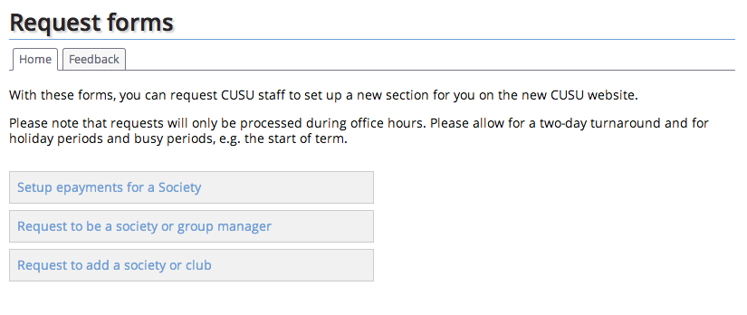

Request forms
=============

This is a PHP application which provides request forms by way of providing a workaround integration with the NUS Digital UnionCloud site. They enable societies and others to request to the student union that a new society or vote be set up.

During Summer 2014, CUSU took the decision to migrate from the existing self-service applications to the NUS Digital UnionCloud platform, which is designed predominantly around a centralised student union model rather than a delegated management (self-service) basis. The CUSU Webmaster was thus asked to create these forms accordingly, to help CUSU staff process change requests.

Screenshot
----------

Usage
-----

1. Clone the repository.
2. Download the library dependencies and ensure they are in your PHP include_path.
3. Download and install the famfamfam icon set in /images/icons/
4. Add the Apache directives in httpd.conf (and restart the webserver) as per the example given in .httpd.conf.extract.txt; the example assumes mod_macro but this can be easily removed.
5. Create a copy of the index.html.template file as index.html, and fill in the parameters.
6. Access the page in a browser at a URL which is served by the webserver.

Dependencies
------------

* [application.php application support library](http://download.geog.cam.ac.uk/projects/application/)
* [frontControllerApplication.php front controller application implementation library](http://download.geog.cam.ac.uk/projects/frontcontrollerapplication/)
* [pureContent.php general environment library](http://download.geog.cam.ac.uk/projects/purecontent/)
* [FamFamFam Silk Icons set](http://www.famfamfam.com/lab/icons/silk/)

Author
------

Martin Lucas-Smith, Cambridge University Students' Union, 2014.

License
-------

GPL2.

